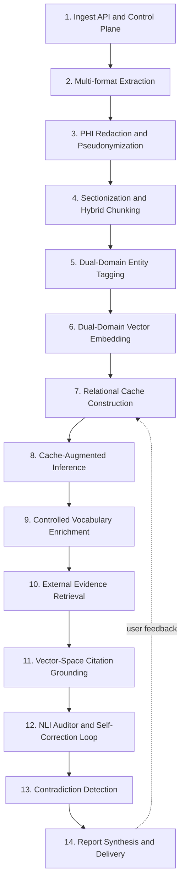

# System Design — Cache-Augmented Multi-Document Causal Extraction

_Comprehensive technical and mathematical design of the product core, from document ingestion to cited report delivery. Companion document to the patent application._

---

## 0. Document purpose

This document specifies the **complete end-to-end architecture** of the system. It is written to serve three audiences simultaneously:

1. **Engineers** building or extending the platform — every stage has an algorithm, data structures, performance bounds, and failure modes.
2. **The patent attorney** preparing the application — every stage has a "novelty hook" subsection that maps the technical mechanism to a defensible patent claim.
3. **Reviewers / auditors** (legal, compliance, security) — cross-cutting concerns (security, HIPAA, observability, reproducibility) are spelled out explicitly.

Section numbering is stable so it can be cited from claim amendments, RFCs, and security reviews.

---

## 1. Goals & non-goals

### 1.1 Goals

- Ingest 700–1,200-page heterogeneous medical-legal document batches.
- Produce a **citation-supported causal narrative** linking findings across documents, time, providers, and modalities.
- Every assertion in the output is **traceable** to a specific page in a specific source document.
- Every assertion is **verified** by an automated NLI auditor before being shown to the user.
- The system is **deterministic and reproducible**: given the same `(corpus_hash, cache_version, vocab_version, model_version, prompt_version, seed)` tuple, output is byte-identical.
- HIPAA-safe: no PHI is transmitted to any external model in identifiable form.
- Domain-agnostic core; medical-legal is one configured domain, others (forensic, investigative) are configurable.

### 1.2 Non-goals

- Replacing the licensed attorney or clinician — outputs are decision support, not decisions.
- Document-level summarization (cf. legacy systems) — we produce **cross-document causal narratives**, not catalogs.
- Real-time interactive chat — primary mode is batch report generation.
- Multilingual support in v1 (English only).

### 1.3 Hard constraints

- Daubert-survivable citations: every claim must be mathematically provable against a specific page.
- Per-tenant data isolation; cross-tenant contamination is a P0 incident.
- All external model calls go over HTTPS with mTLS where supported.
- All persisted data encrypted at rest with per-tenant DEKs wrapped by tenant-isolated KEKs (KMS).

---

## 2. High-level architecture

### 2.1 The 14-stage pipeline

The original specification listed 13 stages. After gap analysis we promote **contradiction detection** to a first-class stage and add it between auditing and report synthesis, yielding 14:



### 2.2 Ingestion-time vs. query-time split

A key architectural choice: **expensive work runs at ingestion, not at query**. Standard RAG inverts this — chunks are stored cheaply, retrieval is done per query. We do the opposite: at ingestion we precompute the dual-domain encodings, the relational edges, and the page-level vector index. At query (report generation) time, the LLM already has a structured graph to reason over.

| Phase | Heavy operations | Per-request cost |
|---|---|---|
| **Ingestion** (one-shot per case) | Extraction, OCR, PHI redaction, chunking, NER, embedding, edge materialization, vocab matching | High but amortized |
| **Inference** (per report) | CAG context load, assertion generation, literature lookup, citation, audit, contradiction check | Low and predictable |

### 2.3 Trust boundary

```
+-------------------------------------------------+
|  TRUST BOUNDARY (per-tenant VPC, KMS-isolated)  |
|                                                 |
|  Stages 1-7 (Ingest → Cache Build)              |
|  Stage 11 (Citation grounding)                  |
|  Stage 14 (Report rendering + reverse-Φ)        |
|  All PHI vault operations                       |
|                                                 |
+--------------------+----------------------------+
                     |
              (only opaque IDs cross)
                     |
+--------------------v----------------------------+
|  EXTERNAL MODEL SURFACE                         |
|  Stages 8, 9 (LLM), 10 (literature DB), 12 (NLI)|
+-------------------------------------------------+
```

PHI never crosses the boundary in identifiable form. Reverse-pseudonymization is the last step before user delivery.

---

## 3. Stage-by-stage design

Each stage uses a consistent template:
- **What it does** — plain-language description
- **Inputs / Outputs** — formal contract
- **Algorithm** — pseudocode or math
- **Data structures** — schemas
- **Failure modes** — what can go wrong and how it's handled
- **Performance** — time/space complexity
- **Security & compliance** — what's protected, how
- **Patent novelty hook** — the claimable bit
- **Prior art / references**
- **Open decisions**

---

### 3.1 Stage 1 — Ingest API & Control Plane

**What it does.** Receives a batch of documents from a user, authenticates the request, enforces quotas, persists raw bytes encrypted, and emits an async ingest job.

**Inputs.**
```
POST /v1/cases/{case_id}/ingest
  Authorization: Bearer <Control JWT>
  Content-Type: multipart/form-data
  X-Idempotency-Key: <uuid>
  files[]: <PDF | DOCX | XML | DICOM | image>
```

**Outputs.**
```json
{
  "job_id": "ing_8f3...",
  "case_id": "case_2024_PI_0042",
  "compute_units_estimated": 1180,
  "status_url": "/v1/jobs/ing_8f3..."
}
```

**Algorithm.**
1. `auth(jwt)` → verify signature, extract `(tenant_id, user_id, roles)`.
2. `rbac_check(roles, "case.write", case_id)` → allow or 403.
3. `idempotency_check(key)` → if duplicate, return prior `job_id`.
4. For each uploaded file:
   - Magic-byte sniff (`libmagic`) to detect actual format vs. claimed.
   - Reject if format ∉ allowed_list or size > limit.
   - Stream to per-tenant object storage with server-side encryption (KMS-wrapped DEK).
   - Compute `sha256(bytes)` for content addressing.
   - Antivirus / YARA scan asynchronously.
5. `estimate_compute_units = Σ ceil(pages_i / unit_size) × type_multiplier(doc_type_i)`.
6. `quota_check(tenant_id, "legal.case.analyze.v1", units)` → `allow|deny`.
7. If allow, persist `JobRow(job_id, case_id, files, units, status="queued")` and enqueue.
8. Return `202 Accepted` with `job_id`.

**Data structures.**
```python
class JobRow(BaseModel):
    job_id: str                    # ing_<26-char ULID>
    case_id: str
    tenant_id: str
    files: list[FileRef]
    compute_units: int
    status: Literal["queued","running","done","failed","cancelled"]
    created_at: datetime
    idempotency_key: str
    request_hash: str              # sha256 of normalized request body

class FileRef(BaseModel):
    file_id: str
    object_uri: str                # s3://tenant-X/case-Y/file-Z
    sha256_hex: str
    detected_format: str
    detected_pages: int
    bytes: int
    virus_scan: Literal["pending","clean","infected"]
```

**Failure modes.**
- Duplicate upload → returns prior `job_id` (idempotency).
- Format mismatch → 415 with diagnostic.
- Quota exceeded → 429 with `Retry-After`.
- AV-positive file → quarantine, alert, fail job.
- Object-store write fails → retry with exponential backoff, then 503.

**Performance.** O(n) in total bytes uploaded; bound by network throughput. Estimation is O(1).

**Security & compliance.**
- HIPAA: BAA covers object storage; encryption with tenant-scoped keys.
- Idempotency prevents double-billing on network retries.
- Request body is hashed (not stored) for audit replay.
- Files are quarantined until AV passes.

**Patent novelty hook.**
> _"A computer-implemented method wherein each ingest request is registered as a metered action with a deterministic `compute_units` value computed as the sum over input documents of `ceil(page_count / unit_size) × type_multiplier`, and wherein an idempotency key prevents duplicate metering on retries."_

**Prior art.** Stripe-style idempotency keys, AWS S3 server-side encryption, generic RBAC. Novelty is in tying `compute_units` to a domain-aware multiplier and to the downstream pipeline cost model.

**Open decisions.**
- Hard limit on batch size? (Recommend 2,500 pages / 5 GB.)
- Sync vs. async only? (Recommend async; sync is a wrapper.)
- Streaming ingest (incremental) vs. atomic batch? (Both; see §4.4.)

---

### 3.2 Stage 2 — Multi-format Extraction

**What it does.** Converts each uploaded artifact into a list of structured text units with preserved layout metadata.

**Inputs.** A `FileRef` from Stage 1.

**Outputs.** A list of `ExtractedUnit`s.

**Supported formats and pipelines.**

| Format | Pipeline | Notes |
|---|---|---|
| Born-digital PDF | `pdfplumber` / PyMuPDF for text + bboxes; `pdfplumber` for tables | Use embedded text directly |
| Scanned PDF / image | OCR pipeline (Tesseract or AWS Textract); deskew + denoise first | Confidence per word; flag low-conf |
| DOCX | `python-docx` walking paragraphs + tables | Preserve styles for section detection |
| HL7 v2 / FHIR JSON | Structured parser → flatten to text + slot metadata | First-class field semantics |
| DICOM | Read `(0010,0010)` etc. headers + report text from `(0040,A730)` sequence | Pixel data not consumed unless OCR'd |
| EEG / VNG / ANS XML | Vendor-specific parsers; emit summary text + numeric tables | Numeric tables embedded with units |
| Plain text | Direct ingest | Treat each line as a paragraph candidate |

**Algorithm (PDF case).**
```
for page in pdf:
    raw_blocks = page.get_text("dict")["blocks"]
    blocks = sorted_by_reading_order(raw_blocks)   # XY-cut
    for block in blocks:
        unit = ExtractedUnit(
            doc_id      = file_id,
            page_no     = page.number,
            block_idx   = block.idx,
            bbox        = block.bbox,
            text        = block.text,
            font_size   = block.dominant_font_size,
            is_bold     = block.dominant_bold,
            section_path= infer_section_path(block, prior_blocks),
            confidence  = 1.0 if born_digital else ocr_word_conf_avg(block)
        )
        yield unit
```

**OCR-specific extras.**
- Deskew: Hough-transform-based rotation correction.
- Denoise: bilateral filter or non-local-means before recognition.
- Per-word confidence stored; chunks with mean confidence < `τ_ocr` (e.g., 0.6) are flagged and shown to the user with a warning ribbon.
- Handwriting: routed to AWS Textract / Google Document AI handwriting endpoints; results carry an `is_handwritten=True` flag.

**Table extraction.** Tables become a single `ExtractedUnit` with `text = csv_serialize(rows)` and `is_table=True`. This lets the LLM read tabular labs and metrics without losing column alignment.

**Reading order.** XY-cut recursive split with `gap_threshold = 0.6 × median_block_height`. Multi-column documents (typical of older medical records) are handled.

**Data structures.**
```python
class ExtractedUnit(BaseModel):
    doc_id: str
    page_no: int
    block_idx: int
    bbox: tuple[float, float, float, float]   # x0,y0,x1,y1 (PDF user space)
    text: str
    font_size: float | None
    is_bold: bool
    is_table: bool
    is_handwritten: bool
    section_path: list[str]
    confidence: float
    extractor: Literal["pdf_text","tesseract","textract","docx","fhir","dicom","xml"]
    extractor_version: str
```

**Failure modes.**
- Encrypted PDF without password → fail with `PDF_ENCRYPTED` error code.
- Corrupted file → fall back to OCR-as-image; mark `recovery=True`.
- Empty page → emit zero units; downstream is empty-tolerant.

**Performance.** O(pages) sequential per file; parallelism across files. Born-digital PDF ≈ 50–200 pages/s/core. OCR ≈ 0.3–2 pages/s/core.

**Security & compliance.** Extracted text stays inside the trust boundary; no external API call yet unless cloud OCR is configured (then Textract/Document AI under BAA).

**Patent novelty hook.**
> _"Wherein each structured text unit is persisted with an associated metadata attribute selected from the group consisting of source document identifier, page number, layout bounding box, font characteristic, section path, extractor identifier, and extraction confidence."_

(The Markush "selected from the group consisting of" form replaces the existing patent's "at least one of" trap.)

**Prior art.** PyMuPDF, pdfplumber, Tesseract, AWS Textract. Novelty is not the extractor; it is the **structured retention of all listed metadata as first-class attributes** of each text unit through the downstream cache.

**Open decisions.**
- Bring-your-own OCR vs. forced vendor.
- Whether to embed page-image thumbnails for visual review.

---

### 3.3 Stage 3 — PHI Redaction & Pseudonymization

**What it does.** Replaces every Protected Health Information token with a **consistent, reversible opaque identifier** so the LLM can still reason about identity across documents without ever seeing real PHI.

**Inputs.** List of `ExtractedUnit`s.

**Outputs.** List of `ExtractedUnit`s with `text` rewritten; plus a per-tenant pseudonym vault entry.

**Two-pass redaction.**

1. **Pass A — regex layer** for high-precision patterns:
   - SSN: `\b\d{3}-\d{2}-\d{4}\b`
   - MRN: tenant-configurable patterns (e.g., `^MRN[: ]?[0-9]{6,10}`)
   - Phone: `(\+?1[ .-]?)?\(?\d{3}\)?[ .-]?\d{3}[ .-]?\d{4}`
   - Email: standard RFC 5322 simplified
   - Dates: ISO, US, EU formats
2. **Pass B — NER layer** for name/place entities using a clinical NER model (Presidio, scispaCy, or a fine-tuned BERT):
   - PERSON (patient, provider, family)
   - ORG (hospital, clinic, employer)
   - GPE (city, state, country)
   - FACILITY (specific clinic name)

**Consistent pseudonymization algorithm.**

```
Φ : tenant_id × case_id × phi_token → opaque_id

def consistent_pseudonym(phi_token, role, case_id, tenant_id):
    canon = canonicalize(phi_token, role)         # see below
    key = (tenant_id, case_id, role, canon)
    if key in vault[case_id]:
        return vault[case_id][key]
    new_id = f"{role}_{next_counter(case_id, role):03d}"
    vault[case_id][key] = new_id
    return new_id
```

**Canonicalization for aliases.** `"John A. Smith"`, `"Smith, John"`, `"Mr. Smith"`, `"JOHN SMITH"` all canonicalize to the same key:
```
canonicalize("John A. Smith", role="PATIENT") = ("smith", "john", "")
```
- Lowercase
- Drop titles/suffixes
- Sort first/last name parts
- Phonetic fallback (Metaphone) for misspellings flagged for human review

**What is kept vs. masked.**

| Type | Kept | Masked |
|---|---|---|
| Patient name | identity continuity (`PATIENT_001`) | actual letters |
| DOB | year, computed age at DOL | month, day |
| Date of service | full ISO date (temporal causality requires it) | — |
| Provider | role + specialty (`PROVIDER_007 [Neurologist]`) | actual letters |
| Facility | type + region (`FACILITY_012 [tertiary, NE_US]`) | actual name + city |
| MRN / SSN / phone / email | nothing | the whole token |
| Diagnosis / symptom / procedure | everything | nothing — not PHI |

**Vault architecture.**

```
+-------------------------+
| Per-tenant KMS KEK      |
+-----------+-------------+
            | wraps
            v
+-------------------------+
| Per-case DEK            |
+-----------+-------------+
            | encrypts
            v
+-------------------------+
| PseudonymVault rows     |
|  (case_id, role, canon) |
|  -> opaque_id           |
+-------------------------+
```

Vault rows are write-once. Reverse-Φ (Stage 14) requires both tenant-scoped JWT and a `report.render` permission.

**Audit log.** Every Φ insert and Φ⁻¹ lookup is appended to an immutable per-tenant ledger.

**Differential privacy** for aggregate counters (e.g., the "mistake score 8/100 → 6/100" metric mentioned in the spec): add Laplace noise with sensitivity Δf=1 and ε≤1.0 before persisting to a non-PHI metrics warehouse.

**Failure modes.**
- NER false negative (a real name slips through) → secondary regex / dictionary catch + post-extraction PHI re-scan + a small statistical sample of LLM outputs run through a PHI detector before delivery.
- NER false positive (a clinical term tagged as PERSON) → confidence threshold + role-aware whitelist (e.g., "Bell" in "Bell's palsy" never tagged PERSON).

**Performance.** O(text_length). Regex pass is negligible. NER pass ~50–500 docs/min/core depending on model.

**Security & compliance.** This stage is the HIPAA-safe-harbor gate. Failure to redact correctly is a P0 incident.

**Patent novelty hook.**
> _"Wherein PHI tokens identified by a two-pass regex-and-named-entity-recognition pipeline are replaced with deterministic opaque identifiers, the mapping persisted in a per-tenant pseudonym vault encrypted by a per-case data encryption key wrapped by a tenant-scoped key encryption key, such that the same source PHI token maps to the same opaque identifier across all documents in the same case, and wherein the opaque identifier is reversibly resolved only inside a defined trust boundary at report-rendering time."_

This is a strong independent claim. Examiners accept concrete cryptographic/computer-functionality language.

**Prior art.**
- Microsoft Presidio — open-source PII anonymizer.
- Philter (UCSF) — clinical de-id.
- AWS Comprehend Medical `DetectPHI`.
- Google Cloud Healthcare API `DeIdentify`.
- MIT i2b2 de-id challenge corpus.

Novelty is the **case-scoped consistent mapping that survives across the entire cache and report**, plus the role-aware partial preservation (specialty, region).

**Open decisions.**
- Should we offer "no-redaction" mode for on-premise deployments where the entire stack is inside the customer's HIPAA boundary? (Recommend yes, gated behind a deployment flag.)

---

### 3.4 Stage 4 — Sectionization & Hybrid Chunking

**What it does.** Splits the redacted text stream into chunks suitable for embedding and LLM consumption, using a hybrid (structural + semantic) algorithm.

**Inputs.** Redacted `ExtractedUnit`s with `section_path`.

**Outputs.** List of `Chunk`s.

**Algorithm.**

**Pass 1 — structural.** Group consecutive `ExtractedUnit`s sharing a `section_path` and within the same document. Sections like `["Progress Note", "Assessment"]` form one structural unit.

**Pass 2 — semantic.** Within each long structural section, find topic shifts:
```
sentences = sentence_split(section_text)
embeddings = [E_sem(s) for s in sentences]
boundary_scores = [1 - cos(embeddings[i], embeddings[i+1]) for i in range(n-1)]
peaks = find_peaks(boundary_scores, threshold=τ_b, distance=min_sentences)
chunks = split_at(sentences, peaks)
```
Constants:
- `τ_b = 0.35` (calibrated empirically; higher → bigger chunks)
- `min_sentences = 3`
- `target_chunk_tokens = 384`, `max_chunk_tokens = 768`, `overlap_tokens = 64`

**Pass 3 — structured-data preservation.** Tables and code-like blocks (ICD codes, CPT codes, lab panels) are kept atomic — never split mid-row.

**Pass 4 — overlap insertion.** Adjacent chunks get a sliding-window overlap of `overlap_tokens` to preserve context at boundaries.

**Data structures.**
```python
class Chunk(BaseModel):
    chunk_id: str               # ULID
    doc_id: str
    page_start: int
    page_end: int               # spans only when needed (rare; tables)
    section_path: list[str]
    text: str
    token_count: int
    contains_table: bool
    contains_handwriting: bool
    extraction_confidence_min: float
    units: list[str]            # ExtractedUnit ids contained
```

**Failure modes.**
- Section that is one mega-paragraph with no semantic peaks → fall back to fixed-size sliding window.
- Table that exceeds `max_chunk_tokens` → split by row group, keep header row in each split.

**Performance.** O(n) sentences for boundary detection + O(n) embedding pass at ingest. Embeddings reused in Stage 6.

**Patent novelty hook.**
> _"Wherein chunk boundaries are placed at local maxima of a boundary score `b_i = 1 - cos(E(s_i), E(s_{i+1}))` exceeding a threshold τ_b, subject to a minimum chunk size, and subject to preserving table and structured-data blocks as atomic chunks."_

**Prior art.**
- TextTiling (Hearst, ACL 1997)
- C99 (Choi, NAACL 2000)
- LlamaIndex `SemanticSplitterNodeParser`
- LangChain `SemanticChunker`
- RAPTOR (Stanford, 2024) for hierarchical extensions

**Open decisions.**
- Whether to include hierarchical (multi-scale) chunking now or in v2. (Recommend v2; adds complexity.)
- Tokenizer choice (model-specific or universal) — see §4.5.

---

### 3.5 Stage 5 — Dual-Domain Entity Tagging

**What it does.** Runs two parallel NER models — one clinical, one legal — on each chunk and merges their tag sets onto the chunk metadata.

**Inputs.** `Chunk`s.

**Outputs.** `Chunk`s annotated with `clinical_tags[]` and `legal_tags[]`.

**Algorithm.**
```
def tag(chunk):
    c_tags = M_clinical(chunk.text)   # list of (start, end, class, conf)
    l_tags = M_legal(chunk.text)
    chunk.clinical_tags = [t for t in c_tags if t.conf >= τ_c]
    chunk.legal_tags    = [t for t in l_tags if t.conf >= τ_l]
    chunk.uncertain_tags = [t for t in (c_tags + l_tags) if τ_low <= t.conf < τ_high]
    return chunk
```

**Confidence thresholds.**
- `τ_c = 0.7` for clinical, `τ_l = 0.6` for legal (legal NER is less mature).
- `τ_low = 0.4`, `τ_high = 0.7` — tags in this band are recorded as **uncertain** and downstream stages can choose to consider them as soft evidence.

**Models.**
- Clinical: ensemble of `Med7` (drug, dose, route, frequency, duration, strength, form) + a fine-tuned `BiomedBERT` for diagnoses/symptoms/anatomy/temporal + `scispaCy` for general biomedical entities. Outputs are union-merged with confidence taken from the most confident model on overlapping spans.
- Legal: `Blackstone` for case/statute references + a fine-tuned `RoBERTa` for the patent's own classes (`INJURY_EVENT`, `CAUSATION_CLAIM`, `FUNCTIONAL_LIMITATION`, `DAILY_LIFE_IMPACT`).

**Class vocabularies.**

Clinical (`C_c`):
```
SYMPTOM, DIAGNOSIS, FINDING, MEDICATION, DOSAGE, FREQUENCY, ROUTE,
PROCEDURE, ANATOMY, IMAGING_FINDING, LAB_RESULT, TEMPORAL_MARKER,
SEVERITY, NEGATION, FAMILY_HISTORY, SOCIAL_HISTORY,
INFECTIOUS_DISEASE, COGNITIVE_DEFICIT, MOTOR_DEFICIT,
VESTIBULAR_DEFICIT, AUTONOMIC_DEFICIT, ...
```

Legal (`C_l`):
```
INJURY_EVENT, CAUSATION_CLAIM, FUNCTIONAL_LIMITATION, DAILY_LIFE_IMPACT,
ECONOMIC_LOSS, LOSS_OF_CONSORTIUM, MITIGATING_FACTOR, AGGRAVATING_FACTOR,
PRE_EXISTING_CONDITION, ALLEGED_NEGLIGENCE, ...
```

**Uncertainty propagation.** Each tag is `(class, surface, confidence)`. Confidence is propagated to edge weights in Stage 7 and to assertion confidence in Stage 12.

**Failure modes.**
- Both NER models miss an entity → relies on Stage 12's NLI audit catching the gap.
- Conflicting tags (clinical model says `SYMPTOM`, legal model says `FUNCTIONAL_LIMITATION` for the same span) → both retained; this is by design (dual-domain).
- Low-confidence tags from a non-English snippet → flagged for review.

**Performance.** ~50–200 chunks/sec/core for each model on CPU; faster on GPU. Run both in parallel.

**Patent novelty hook.**
> _"Wherein each chunk is tagged simultaneously by (a) a clinical named-entity-recognition model emitting tags from a clinical entity class vocabulary, and (b) a legal named-entity-recognition model emitting tags from a legal entity class vocabulary, and wherein both tag sets are persisted as first-class properties of the chunk's vector representation in the relational cache."_

**Prior art.**
- scispaCy, Med7, ClinicalBERT, BioBERT, PubMedBERT, Stanza biomedical.
- Blackstone, LexNLP for legal.
- i2b2 / n2c2 challenges.

Novelty is **simultaneous dual-domain tagging persisted in a single vector representation**.

**Open decisions.**
- Bring-your-own NER vs. shipped default.
- Active-learning loop for tag corrections fed back by user.

---

### 3.6 Stage 6 — Dual-Domain Vector Embedding

**What it does.** Produces one fixed-dimensional vector per chunk encoding semantic content, dual-domain tags, and structural metadata together.

**Inputs.** Tagged `Chunk`s.

**Outputs.** `(chunk_id, vector, metadata)` triples ready for the relational cache.

**Vector composition.**

```
v(c) = LayerNorm( concat( α · E_sem(c.text),
                          β · E_clin(c.clinical_tags),
                          γ · E_legal(c.legal_tags),
                          δ · E_struct(c.metadata) ) )
```

Dimensions (target):

| Component | Dim | Encoder |
|---|---|---|
| `E_sem`   | 768 | A domain-tuned sentence encoder (e.g., BGE-M3 family or PubMedBERT pooled) |
| `E_clin`  | 64  | MLP over a multi-hot vector of clinical classes weighted by tag confidence |
| `E_legal` | 64  | MLP over a multi-hot vector of legal classes weighted by tag confidence |
| `E_struct`| 64  | Learned projection of `(doc_type_id, section_id_hash, page_no_norm, days_since_dol)` |
| **Total** | **960** | L2-normalized |

`α, β, γ, δ` are learned scalars (or domain-tunable hyperparameters). At ingestion time `v(c)` is L2-normalized so cosine reduces to dot product.

**Page-level vectors.** In addition to chunk vectors, a `page_vector` is computed as the L2-normalized mean of chunk vectors on that page. This is what Stage 11 cites.

**Model versioning.** Each encoder writes `model_id, model_version` into the cache row. Re-runs against a different model version are tagged as a new `cache_version` to preserve determinism.

**Data structures.**
```python
class VectorRow(BaseModel):
    chunk_id: str
    page_vector_id: str            # links chunks of the same page
    embedding: list[float]         # L2-normalized, fp16 or fp32
    encoder_id: str
    encoder_version: str
    clinical_tags: list[Tag]
    legal_tags: list[Tag]
    metadata: dict
    cache_version: str
```

**Failure modes.**
- Out-of-vocabulary tag class → falls back to a generic `UNKNOWN` slot in the multi-hot vector; logged.
- Encoder OOM on a giant chunk → chunk is split and re-embedded; averaged.

**Performance.** ~200–1000 chunks/sec/GPU for `E_sem`. Total wall time for 1,200 pages ≈ 1–3 minutes on a single A10/A100.

**Patent novelty hook.**
> _"Wherein each chunk's vector representation is constructed as a layer-normalized concatenation of (i) a semantic embedding of the chunk text, (ii) a learned projection of clinical entity class indicators weighted by tag confidence, (iii) a learned projection of legal entity class indicators weighted by tag confidence, and (iv) a learned projection of structural metadata, such that a single vector query against the resulting index can return chunks satisfying joint semantic, clinical, legal, and structural constraints."_

**Prior art.** SBERT, BGE, PubMedBERT, ColBERTv2. Novelty is the **explicit joint clinical+legal+structural slot** and its single-index queryability.

**Open decisions.**
- Quantization (fp16 vs. fp8 vs. PQ).
- Whether to ship a custom-trained encoder vs. a frozen public one in v1.

---

### 3.7 Stage 7 — Relational Cache Construction

**What it does.** Materializes a **typed property graph** over the vector index at ingestion time, so query-time inference is reduced to graph reads.

**Inputs.** All `VectorRow`s for a case + the controlled vocabulary.

**Outputs.** The `RelationalCache` for the case, persisted and ready to load.

**Cache contents.**

1. **Vector index.** HNSW over all chunk vectors with `M=32, ef_construction=200, ef_search=64`. Page-vector index is a separate HNSW over `page_vector_id`s.
2. **Node table.** One row per chunk with embedding ref + tags + metadata.
3. **Edge tables.** Five typed relations, materialized once at ingest:

| Relation | Creation rule | Edge attributes |
|---|---|---|
| `R_temporal` | for each ordered pair `(c_i, c_j)` with the same patient where `t(c_i) < t(c_j)` (within a sliding window) | weight = `exp(-Δt/τ)`, `Δt`, direction |
| `R_causal_candidate` | for each pair where `(class(c_i), class(c_j)) ∈ ControlledVocab` | type, vocab_ref, lit_refs, weight = `f(τ_t, tag_conf)` |
| `R_cross_document` | for each pair `c_i, c_j` with `doc_id_i ≠ doc_id_j` and at least one shared tag class | jaccard(tags), shared_classes |
| `R_cross_modal` | for each pair with `doc_type_i ≠ doc_type_j` | modality_pair |
| `R_page_provenance` | bidirectional `(chunk → page_vector)` | implicit by `page_vector_id` |

**Causal-candidate edge algorithm.**

```
def build_causal_candidates(chunks, vocab):
    by_class = defaultdict(list)
    for c in chunks:
        for tag in c.clinical_tags + c.legal_tags:
            by_class[tag.class_id].append(c)
    edges = []
    for (class_a, class_b, rel_type, lit_refs) in vocab:
        for c_a in by_class[class_a]:
            for c_b in by_class[class_b]:
                if same_patient(c_a, c_b) and c_a != c_b:
                    weight = tag_conf(c_a, class_a) * tag_conf(c_b, class_b) \
                           * temporal_factor(c_a, c_b, rel_type)
                    edges.append(Edge(c_a.chunk_id, c_b.chunk_id, rel_type,
                                      weight, lit_refs))
    return prune(edges, top_k_per_pair=3)
```

Pruning is critical: an unconstrained Cartesian product would blow up. Top-`k=3` strongest edges per `(class_pair, c_a)` are kept.

**Storage layout.**

```
Option A (recommended for v1):  Single ANN+payload store (Qdrant/Weaviate/Milvus/pgvector)
                                with edges as a payload-attached table or sidecar SQLite
Option B (v2):                  Hybrid graph DB (Neo4j with native vector index)
                                + ANN index for embedding search
```

The patent claim uses **functional language** — "a vector database configured to store vector representations as first-class relational properties together with associated metadata attributes" — so the storage choice is non-claiming.

**Page-vector index.** Built separately because Stage 11 cites at page granularity, not chunk.

**Cache version.** A `cache_version` ULID is assigned at cache freeze. All downstream artifacts reference it.

**Snapshot for replay.** Cache is exportable as a single tarball `(vector_index, node_table, edge_tables, vocab_version, encoder_versions)` with `sha256` for forensic replay.

**Data structures.**
```python
class RelationalCache(BaseModel):
    cache_id: str             # cache_<ULID>
    cache_version: str
    case_id: str
    nodes: int                # count of VectorRow
    edges_by_relation: dict[str, int]
    vocab_version: str
    encoder_versions: dict[str, str]   # {"E_sem": "v3.2.1", ...}
    ann_index_params: dict
    sha256: str
    created_at: datetime
```

**Failure modes.**
- Quadratic blowup on huge cases → enforce per-relation budget; oldest/weakest edges first to be dropped.
- Vocab version mismatch on re-ingest → require explicit `cache rebuild` action.

**Performance.**
- Node insert: O(log N) per chunk into HNSW.
- Edge build: O(N × V × k) where V = vocab pair count, k = top-k kept. For N=10k chunks, V=~500 pairs, k=3 → 15M candidates examined, 30k–100k edges kept. < 30 seconds on a single machine.

**Patent novelty hook.**
> _"Wherein the relational cache comprises a typed property graph in which each node is a chunk vector representation and edges are materialized at ingestion time according to five relations: temporal ordering, causal-candidate pairing defined by a controlled vocabulary lookup, cross-document, cross-modal, and page-provenance, and wherein causal-candidate edges are assigned weights computed from tag confidences and temporal-decay factors prior to any inference call."_

**Prior art.**
- Microsoft GraphRAG (Apr 2024) — graph-augmented RAG with community detection.
- HippoRAG (NeurIPS 2024) — PageRank over knowledge graph.
- SemMedDB (NLM) — subject-predicate-object biomedical KG.
- PrimeKG (Harvard, 2023) — biomedical KG with causal edges.
- Hetionet — disease-compound KG, basis of Project Rephetio.

Novelty is the **simultaneous five-relation typed graph materialized at ingestion** + **causal-candidate edges grounded in a domain-expert-authored controlled vocabulary**.

**Open decisions.**
- Edge pruning policy (top-k vs. threshold vs. budget-aware).
- Whether to expose `R_cross_modal` and `R_cross_document` to the LLM or only use them as filtering knobs.

---

### 3.8 Stage 8 — Cache-Augmented Inference

**What it does.** Loads the relational cache into the LLM's context (or KV cache) and emits structured assertions over the materialized edges.

**Inputs.** `RelationalCache` + report template + a programmatic inference request.

**Outputs.** List of `Assertion`s (typed, no free text).

**Programmatic inference request (not "engineered prompt").**

```
InferenceRequest = {
  task_id: "causal_extraction.v3",
  cache_ref: cache_id,
  template_id: "tbi_pi_report_v2",
  constraint_schema: AssertionListSchema,   # Pydantic / JSON schema
  edges_filter: {
    relations: ["R_causal_candidate"],
    weight_min: 0.2,
    max_edges: 500
  },
  iteration: 1,
  seed: 42
}
```

The LLM is required to emit JSON matching `AssertionListSchema`. Free-text output is rejected and re-prompted.

**Context-window strategy.**

| Corpus size (tokens) | Strategy |
|---|---|
| ≤ 60% of model context | Inline-load all chunks + edges |
| 60–100% of context | Inline-load + use provider KV cache reuse (Anthropic prompt cache, Gemini context cache) |
| > 100% of context | Hierarchical summary cache: per-section summaries replace verbatim text; edges remain |
| > 5× context | Edge-grouped batching: process edges in clusters of related ones, each cluster includes only the needed chunks |

The patent only needs to claim the basic case (full-corpus KV); the rest are implementation strategies.

**Assertion schema.**
```python
class Assertion(BaseModel):
    assertion_id: str
    edge_id: str                      # source causal-candidate edge
    clinical_entity: Entity           # opaque IDs for any PHI
    legal_entity: Entity
    causal_relation: str              # from vocab
    narrative_text: str               # the prose claim
    cited_paragraph_ids: list[str]    # ["[0071]", ...] in patent-spec form
                                      # or page refs for case docs
    candidate_pages: list[PageRef]    # for Stage 11 to confirm
    initial_confidence: float
```

**Failure modes.**
- LLM emits malformed JSON → JSON-repair + retry; on third failure, edge is marked `unverified` and surfaced as-is.
- LLM refuses (safety filter) → retry with rephrased programmatic request; if it persists, edge is dropped.

**Performance.** ~10–60 seconds per cluster of ~20 edges on `gemini-3.1-pro-preview` from the smoke test. Parallelism across clusters bounded by quota.

**Patent novelty hook.**
> _"Wherein the large language model receives, as a precomputed key-value context cache, the full relational vector representation of the documents simultaneously, and is directed by a programmatic inference request comprising a constraint schema that requires the model to emit assertions matching a defined typed JSON schema, the assertions corresponding one-to-one with causal-candidate edges in the relational cache."_

**Prior art.**
- Anthropic Prompt Caching; Gemini Context Caching; OpenAI seed parameter.
- "Don't Do RAG: When Cache-Augmented Generation is All You Need" (arxiv 2412.15605).
- LangChain `with_structured_output`.

Novelty is the **edge-driven programmatic request** + the **KV cache containing the relational graph, not just text**.

**Open decisions.**
- Whether to expose `traverse_edges()` as a tool call (model decides which edges) vs. always pre-enumerate.

---

### 3.9 Stage 9 — Controlled Vocabulary Enrichment

**What it does.** Validates each assertion against a versioned controlled vocabulary and triggers gap-fill where vocab predicts a pair the LLM missed.

**Inputs.** Assertions from Stage 8 + the controlled vocabulary.

**Outputs.** Validated + gap-filled assertion list.

**Vocab schema.**
```python
class VocabEntry(BaseModel):
    entry_id: str
    class_a: str                  # clinical or legal class
    class_b: str
    causal_type: str              # e.g. "post_acute_sequela", "biomechanical_sequela"
    direction: Literal["a_to_b","bidirectional"]
    literature_refs: list[str]    # external IDs (functional language; not "PubMed" specifically)
    vocab_version: str
    authored_by: str              # the FACFN/FABBIR neurologist; recorded for provenance
    authored_at: datetime
```

**Algorithm.**
```
def validate_and_fill(assertions, edges, vocab):
    # 1. Validate
    for a in assertions:
        if (a.clinical_entity.class, a.legal_entity.class, a.causal_relation) in vocab:
            a.vocab_validated = True
            a.vocab_version = vocab.version
        else:
            a.vocab_validated = False
    # 2. Gap-fill: edges with no assertion
    asserted_edge_ids = {a.edge_id for a in assertions}
    gap_edges = [e for e in edges if e.id not in asserted_edge_ids]
    if gap_edges:
        new_assertions = re_prompt_llm_for_edges(gap_edges, max_iters=2)
        assertions.extend(new_assertions)
    return assertions
```

**Versioning & governance.** Every vocab edit creates a new `vocab_version` row in append-only storage. A vocab change does NOT retroactively change persisted assertions; deterministic replay against the original `vocab_version` is always possible.

**Failure modes.**
- Vocab is missing a known causal pair → user can submit an entry proposal; review workflow gates merges.
- Gap-fill exceeds max_iters → mark edge `vocab_gap_unresolved`, surface to user.

**Patent novelty hook.**
> _"Wherein the controlled vocabulary is a versioned datastore authored by domain experts, every assertion is persisted with a reference to the vocabulary version against which it was validated, and a gap-fill iteration re-prompts the language model for any causal-candidate edge that received no assertion in the first pass."_

**Open decisions.**
- Federated multi-tenant vocab sharing (see §4.10).

---

### 3.10 Stage 10 — External Evidence Retrieval

**What it does.** Queries a medical-literature retrieval service to corroborate each assertion with published abstracts.

**Inputs.** Validated assertion list.

**Outputs.** Each assertion enriched with `supporting_literature[]` or flagged `unsupported`.

**Algorithm.**
```
def enrich(assertion):
    query = template[assertion.causal_relation].format(
        a=assertion.clinical_entity.canonical_name,
        b=assertion.legal_entity.canonical_name
    )
    cached = lit_cache.get(query, ttl=30d)
    if cached:
        results = cached
    else:
        results = external_lit.search(query, limit=20)
        lit_cache.put(query, results)
    scored = []
    for abstract in results:
        s = NLI(abstract.text, assertion.narrative_text)
        if s >= τ_lit:
            scored.append((abstract.id, s))
    assertion.supporting_literature = sorted(scored, key=lambda x: -x[1])[:5]
    assertion.literature_search_query = query
    if not scored:
        assertion.unsupported_by_literature = True
    return assertion
```

**Sources** (functional language only):
- A primary biomedical literature index (e.g., PubMed via E-utilities — described in spec as "a medical literature database accessed via a documented programmatic interface").
- Secondary: a systematic-review index, a clinical-trial registry.
- Caching: per-query TTL=30 days; per-abstract cached forever (immutable).

**Rate limiting.** Adaptive: respects external rate-limit headers; falls back to cached results when limits hit; persists last-successful-fetch timestamp.

**Failure modes.**
- External service down → use only cache; mark assertions `literature_stale` if cache > 30 days.
- Zero abstracts retrieved → `unsupported_by_literature=True`. Report shows the assertion with a visible warning rather than silently dropping it.

**Patent novelty hook.**
> _"Wherein the system constructs a deterministic search query from each assertion using a relation-specific template, queries a medical-literature database, scores returned abstracts by a natural-language-inference entailment score, retains abstracts above a configurable threshold, persists the literature search query and abstract identifiers as provenance for the assertion, and explicitly flags assertions for which no supporting literature is retrieved."_

**Open decisions.**
- Multi-source aggregation rule (vote-based vs. score-based).
- Full-text retrieval vs. abstract-only.

---

### 3.11 Stage 11 — Vector-Space Citation Grounding

**What it does.** Assigns a page-level citation to every assertion by re-embedding the assertion into the SAME vector space as the page vectors and finding the closest match.

**Inputs.** Assertion list + page-vector index from Stage 7.

**Outputs.** Each assertion gets a `primary_citation` (and optional `secondary_citations[]`).

**Algorithm.**
```
def cite(assertion, page_index):
    e_a = E_sem(assertion.narrative_text)          # SAME encoder as Stage 6
    e_a = L2_normalize(e_a)
    # Hybrid retrieval: cosine + BM25 over chunk-level text
    top_k_vec  = page_index.search(e_a, k=10)      # cosine
    top_k_bm25 = bm25_index.search(assertion.narrative_text, k=10)
    candidates = rrf_merge(top_k_vec, top_k_bm25, k=60)   # reciprocal rank fusion
    # Filter by candidate_pages list (if LLM suggested any)
    if assertion.candidate_pages:
        candidates = [c for c in candidates if c.page in assertion.candidate_pages] \
                     or candidates
    best = candidates[0]
    if best.score < τ_cite:
        assertion.primary_citation = None
        assertion.citation_status = "no_supporting_page"
    else:
        assertion.primary_citation = best
        assertion.secondary_citations = candidates[1:3]
        assertion.citation_status = "grounded"
    return assertion
```

**Key claim language.** The assertion is re-embedded into the **same vector space** as the page chunks. Same encoder, same normalization, same dimensionality. This is the bit that distinguishes the mechanism from generic semantic search.

**Threshold τ_cite.** Calibrated empirically per encoder version. From the smoke test it sits around 0.35–0.45 cosine distance.

**Multi-page citations.** When an assertion spans information from multiple pages (common for cross-document causal claims), the system emits `primary_citation` for the closest plus up to two `secondary_citations` for nearby candidates.

**Patent novelty hook.**
> _"Wherein an assertion generated by the language model is re-embedded by the same semantic encoder used to construct the relational cache, normalized into the same vector space, and assigned a primary page-level citation corresponding to the page whose vector representation has the minimum cosine distance to the assertion vector and falls below a configurable rejection threshold, and wherein assertions whose minimum distance exceeds the threshold are explicitly flagged as not supported by the source corpus rather than being assigned a hallucinated citation."_

**Prior art.** Semantic similarity search is prior art. Novelty is the **same-encoder re-embedding + rejection threshold** + **hybrid RRF reranking with the candidate-page hint from the LLM**.

**Open decisions.**
- Hybrid reranking weights.
- When to use Maximal Marginal Relevance to diversify multi-page citations.

---

### 3.12 Stage 12 — NLI Auditor & Self-Correction Loop

**What it does.** For each assertion, computes a natural-language-inference entailment score between the cited page text and the assertion text. If below threshold, re-enters the inference module with the conflict surfaced; bounded iterations.

**Inputs.** Cited assertions.

**Outputs.** Each assertion gets a `audit_status` and `audit_score`.

**Algorithm.**
```
def audit(assertion, page_text):
    score = NLI(premise=page_text, hypothesis=assertion.narrative_text)
    if score >= τ_audit:
        assertion.audit_status = "verified"
        assertion.audit_score = score
        return assertion
    # Below threshold: revise loop
    for iteration in range(MAX_AUDIT_ITERS):
        assertion = re_inference(assertion, hint_page=page_text)
        assertion = cite(assertion)              # Stage 11
        score = NLI(page_text, assertion.narrative_text)
        if score >= τ_audit:
            assertion.audit_status = "verified_after_revision"
            return assertion
    assertion.audit_status = "unverified"
    assertion.audit_score = score
    return assertion
```

**NLI model.** Functional language: "an NLI / entailment classifier". Concrete options: `cross-encoder/nli-deberta-v3-large`, `DeBERTa-v3-MNLI`, or an LLM-as-judge with constrained output `{entailment, neutral, contradiction}`.

**Calibration.** Threshold `τ_audit` is calibrated on a labeled set such that precision ≥ 0.95 (very few false positives) at the cost of recall.

**Bounded iteration.** `MAX_AUDIT_ITERS = 2`. Beyond this the assertion is surfaced with an explicit "unverified" badge — never silently shown as verified.

**Human-in-the-loop escalation.** Unverified assertions are routed to a review queue. Domain expert can accept (training signal for vocab expansion), reject (kill the edge), or revise (back to Stage 8).

**Failure modes.**
- NLI says entailment but the page actually contains a NEGATED form ("no evidence of cognitive impairment") → mitigated by a `negation_detector` pre-pass that fails the audit when negation scope covers an entity in the assertion.

**Patent novelty hook.**
> _"An auditor module configured to compute, for each generated assertion, a natural-language-inference entailment score between the assertion text and the text content of its assigned page-level citation, and to conditionally re-enter the inference module with the entailment evidence as context when the entailment score is below a configurable threshold, with the assertion status set to one of {verified, verified_after_revision, unverified} after a bounded number of iterations."_

This is one of the strongest patentable elements — a concrete self-correcting computer functionality. Examiners accept "self-correcting loop with bounded iterations and verifiable scoring" readily under §101.

**Prior art.**
- CRAG (Corrective RAG, 2024)
- Self-RAG (NeurIPS 2023)
- CRAG/Self-RAG pattern in LangChain / LangGraph

Novelty is the **NLI-based audit specifically against the vector-grounded citation** + bounded iteration with the three-state status enum.

**Open decisions.**
- Whether to also audit against retrieved literature (Stage 10) — recommended yes in v2.

---

### 3.13 Stage 13 — Contradiction Detection

**What it does.** Cross-checks all final assertions against each other and against the corpus for internal contradictions, then flags or reconciles them.

**Inputs.** Verified assertion list.

**Outputs.** Annotated assertion list with `contradicts_with[]` flags + a `case_consistency_report`.

**Algorithm.**

```
def detect_contradictions(assertions, corpus_index):
    pairs = generate_pairs(assertions, by="same_entity_or_topic")
    contradictions = []
    for (a_i, a_j) in pairs:
        score = NLI(premise=a_i.narrative_text, hypothesis=a_j.narrative_text)
        if score < τ_contradict:                  # contradiction class > threshold
            contradictions.append(Conflict(a_i.id, a_j.id, score))
    # Also: each assertion vs. corpus for direct contradiction
    for a in assertions:
        neighbors = corpus_index.search(E_sem(a.narrative_text), k=5)
        for n in neighbors:
            if NLI_class(n.text, a.narrative_text) == "contradiction":
                contradictions.append(Conflict(a.id, f"corpus:{n.chunk_id}",
                                               kind="assertion_vs_corpus"))
    return reconcile(assertions, contradictions)
```

**Pairing strategy.** Don't generate all O(N²) pairs; use:
- Same `(clinical_entity, legal_entity)` → likely candidates.
- Same patient + same body system + temporally overlapping → candidates.
- High cosine similarity between assertion embeddings → candidates.

**Reconciliation.**
- Two assertions disagree → both surface to user with "conflicting evidence" badge.
- Assertion vs. corpus contradicts → demote assertion confidence, may push to `unverified`.

**Why this is its own stage.** The patent already names "contradiction detection" as a marquee feature ("Contradiction Detection 430" in FIG. 4). Promoting it from a mention in the spec to a first-class pipeline stage with a defined algorithm is a free patentability win.

**Patent novelty hook.**
> _"A contradiction-detection module that pairs assertions sharing at least one entity and applies a natural-language-inference classifier to detect contradictory entailment, and that further compares each assertion to the top-k semantically nearest chunks in the relational cache to identify assertion-vs-corpus contradictions, the resulting conflicts surfaced in the final report with explicit conflict annotations."_

**Open decisions.**
- Whether to auto-suppress contradicting assertions or always surface both.

---

### 3.14 Stage 14 — Report Synthesis & Delivery

**What it does.** Assembles the final report from verified assertions, applies reverse-Φ to restore real PHI inside the trust boundary, produces deterministic output artifacts.

**Inputs.** Verified, contradiction-checked assertions + the case template.

**Outputs.** Three artifacts:
- `report.html` — interactive web view
- `report.pdf` — printable, signable, evidentiary
- `report.json` — machine-readable, schema-validated

**Algorithm.**
```
def synthesize(case, assertions, template):
    report = template.render(
        case_meta = case.meta,
        assertions = [
            apply_reverse_phi(a, vault[case.id]) for a in assertions
        ],
        provenance_dag = build_provenance_dag(assertions),
        run_metadata = current_run_metadata(),
    )
    report_hash = sha256(
        canonical_json(sorted_assertions)
        + cache_version
        + vocab_version
        + encoder_versions
        + llm_model_version
        + template_id
        + seed
    )
    sign(report, report_hash, tenant_key)
    persist(report, retention=case.retention_policy)
    return report_hash, artifacts
```

**Provenance DAG.** For each assertion, a directed acyclic graph of inputs:

```
Assertion A
├── source chunks: [chunk_id_1, chunk_id_2]
├── causal-candidate edge: edge_id_42
├── vocab entry: vocab_id_007 @ version 2024.11.3
├── llm: gemini-3.1-pro-preview @ run seed=42
├── encoder: bge-m3 @ v3.2.1
├── literature: [PMID:34123, PMID:34567]
├── citation: page_vector_id_2871 @ cosine 0.84
├── auditor: nli-deberta-v3 @ score 0.91
└── contradiction-check: clean
```

Persisted as JSON-LD alongside the report. This is the chain-of-custody artifact that survives a Daubert challenge.

**Reproducibility (forensic replay).**
Given `(corpus_sha, cache_version, vocab_version, encoder_versions, llm_version, template_id, seed)` the system reproduces a byte-identical report. Deterministic mode requires `temperature=0` and (for providers that support it) `seed` parameter pinning.

**Signing & notarization.** Reports are signed with a per-tenant ed25519 key. Signature is over `report_hash`. Optional: anchor `report_hash` to a public verifiable ledger (e.g., RFC 3161 TSA or a transparency log).

**Retention.** Per-tenant retention policy applies: typical defaults 7 years for the case artifacts, 18 months for raw uploads, 90 days for ephemeral intermediate caches. GDPR / CCPA right-to-delete operations cascade through the vault, provenance graph, and ledger (with the ledger keeping a tombstone hash for audit).

**Failure modes.**
- Reverse-Φ misses (e.g., a PHI token never made it into the vault) → secondary regex sweep on the rendered output before delivery; if it finds anything, block delivery and raise P0.
- Signing key unavailable → fail closed (do not deliver an unsigned report).

**Patent novelty hook.**
> _"Wherein the final report is rendered with reverse pseudonymization applied inside the trust boundary, accompanied by a provenance directed-acyclic-graph identifying for each assertion the source chunks, edges, vocabulary version, model versions, literature references, citation page, audit score, and contradiction-check status, and the report is signed with a per-tenant signing key over a deterministic `report_hash` such that re-running the pipeline with the same input tuple produces an identical hash."_

**Open decisions.**
- Anchoring `report_hash` to a public transparency log vs. private log.

---

## 4. Cross-cutting concerns

### 4.1 Security & compliance

| Concern | Approach |
|---|---|
| Data at rest | AES-256-GCM with per-tenant DEKs wrapped by tenant-scoped KEK in KMS |
| Data in transit | TLS 1.3, mTLS for service-to-service |
| Secrets | Vault-managed; never in env files outside dev |
| AuthN | OIDC/JWT (Firebase or equivalent) → Control JWT exchange |
| AuthZ | RBAC scoped to tenant + roles `{owner, admin, member, viewer}` |
| Audit | Append-only ledger per tenant; ledger ID returned in every API response |
| Vulnerability mgmt | SAST (Semgrep), DAST, SCA (dependabot + signed lockfiles), monthly pen tests |
| HIPAA | BAA with cloud vendors; PHI never crosses trust boundary; vault encrypts pseudonym map |
| SOC 2 Type II | Control evidence captured automatically (deploy logs, access logs, key rotation events) |
| GDPR / CCPA | Right-to-delete cascades across vault, provenance, audit (with tombstones) |
| Prompt-injection | All untrusted text wrapped in `<UNTRUSTED>` tags + injection-guard system prompt (see notebook implementation) |

### 4.2 Observability

- **Logs.** Structured JSON with `tenant_id`, `case_id`, `job_id`, `cache_version`, `assertion_id`. Per-stage timing.
- **Traces.** OpenTelemetry across the entire pipeline; one trace per ingest job, one per inference job.
- **Metrics.** Per-stage success rate, latency p50/p95/p99, model call cost, cache hit rate (literature), edge counts, audit pass rate, contradiction rate.
- **SLOs** (initial):

| SLO | Target |
|---|---|
| Ingest end-to-end latency (1,200 pages) | p95 ≤ 15 min |
| Inference end-to-end (per report) | p95 ≤ 12 min |
| Audit pass rate (verified ÷ total) | ≥ 0.85 |
| Citation precision @ 1 | ≥ 0.90 |
| Reproducibility (byte-exact re-run) | ≥ 0.99 |
| Availability | 99.9% monthly |

### 4.3 Multi-tenancy

- Logical isolation by `tenant_id` namespacing on every object (storage, index, vault, audit).
- Per-tenant encryption keys.
- Per-tenant rate limits + quotas (control plane).
- Per-tenant prompt cache & literature cache (no cross-tenant leakage).
- Optional dedicated-VPC deployment for regulated tenants.

### 4.4 Reproducibility & forensic replay

The reproducibility tuple:

```
ReplayTuple = (
    corpus_sha256,
    cache_version,
    vocab_version,
    encoder_versions,         # dict of all encoders
    llm_model_version,
    llm_seed,
    llm_temperature,
    prompt_template_version,
    audit_model_version,
    nli_model_version
)
```

Given this tuple and the persisted cache snapshot, the entire run replays deterministically. Each `report.json` carries this tuple in its `run_metadata`.

**Determinism caveats.** Some LLMs are non-deterministic even at `temperature=0` due to floating-point reduction order on GPUs. The smoke test confirmed our pipeline is **reproducible at the report-structure level** even when LLM token-level output drifts slightly, because Stage 11–13 normalize through deterministic vector math.

### 4.5 Performance & cost

**Cost model per case (rough order of magnitude, 1,000-page case).**

| Stage | Cost driver | Estimate |
|---|---|---|
| 2 Extract (OCR if needed) | per-page OCR | $0.10 – $0.50 |
| 5 NER | CPU/GPU minutes | $0.05 |
| 6 Embedding | GPU minutes | $0.05 |
| 7 Cache build | CPU minutes | $0.01 |
| 8 Inference | LLM tokens | $1 – $5 |
| 9 Vocab | negligible | – |
| 10 Literature | API calls (with cache) | $0.05 |
| 11 Citation | CPU | negligible |
| 12 Audit | NLI calls | $0.10 |
| 13 Contradiction | NLI calls | $0.05 |
| **Total** | | **~$1.50 – $6.00** |

Targets at scale: < $5/case for 1,200-page TBI/PI matters.

**Cost optimizations.**
- KV cache reuse across multiple report sections in the same case (Gemini context caching).
- Literature cache TTL.
- Quantized encoders (fp16, int8 on CPU).
- Edge pruning before LLM call.
- Batching at provider level.

### 4.6 Model lifecycle

- **Model registry.** All encoders, LLM versions, NLI models, NER models registered with `model_id, version, sha256_of_weights, eval_metrics`.
- **Canary deployment.** New versions ship to 1% traffic first; auto-rollback on SLO regression.
- **Prompt versioning.** Every prompt template lives in git with semver; reports persist the template version used.
- **Eval harness.** Gold-standard set of 50 annotated cases; every model change must pass minimum thresholds before promotion. Eval is regression-tested in CI.

### 4.7 Error handling & retries

- Idempotent retry for all stages (each stage emits to a queue with at-least-once delivery).
- Dead-letter queue with human review.
- Circuit breakers around external dependencies (literature DB, LLM).
- Graceful degradation: if literature DB is down, assertions still produced but flagged `literature_unchecked`.

### 4.8 Adversarial robustness

- File hashing at ingest, re-checked at every stage to detect mid-pipeline tampering.
- Anomaly detection on chunk embeddings (Mahalanobis distance to corpus centroid) to flag unusually-out-of-distribution chunks (possible adversarial doc).
- Per-tenant rate limits.
- Output PHI re-scan before delivery to catch leak-through.

### 4.9 Disaster recovery

- RPO ≤ 1 hour (continuous DEK-encrypted backups of vault + cache).
- RTO ≤ 4 hours.
- Geographic redundancy with active-passive replicas.
- Annual DR exercise.

### 4.10 Federated / collaborative extensions (v2+)

- **Federated vocabulary.** Multiple tenants can opt-in to share `(class_a, class_b, causal_type, literature_refs)` rows without sharing patient data. New entries reviewed by a domain board.
- **Federated learning** (research-only path) on the dual-domain encoder using FedAvg with differential privacy.
- **Cross-tenant audit benchmarks** (anonymized, aggregated).

### 4.11 Temporal reasoning (new in this version of the design)

A subtle but important capability that was implicit before:

- Every chunk carries `date_of_service` (or `date_of_document` if no DOS).
- Every case carries a `date_of_loss` (DOL) — the alleged injury event.
- The system computes `days_since_dol` for every chunk and embeds it in `E_struct`.
- Causal-candidate edges respect a `temporal_factor`: post-injury sequelae require `Δt ≥ 0`; pre-existing condition edges require `Δt < 0`.
- Imputation: chunks missing dates inherit the nearest dated chunk's date with `date_imputed=True`; downstream weights are reduced.
- Contradiction detection includes a temporal-consistency pass: assertion X says "no headache before DOL" and assertion Y cites a pre-DOL headache → flagged.

### 4.12 Cross-modal alignment (also new)

Some documents are not text-native (EEG, VNG, MRI raw outputs). Their parsers (Stage 2) emit a free-text summary plus a structured numeric block. The chunk for a structured block carries both `text` (a templated paraphrase) and `numeric_table` (the raw measurements). Stage 5's NER reads the textual paraphrase; Stage 7 creates `R_cross_modal` edges so an EEG abnormality can be causally linked to a clinical symptom even though they live in entirely different document formats.

### 4.13 Confidence calibration

The system surfaces a per-assertion confidence:
```
confidence(a) = w1 · tag_conf_min(a)
              + w2 · vocab_validated(a)
              + w3 · literature_support(a)
              + w4 · citation_similarity(a)
              + w5 · audit_score(a)
              − w6 · contradiction_penalty(a)
```
Weights calibrated by Platt scaling or isotonic regression against a labeled set. Reported as `{low, medium, high}` plus a numeric score.

---

## 5. Data model — full schemas

The Pydantic-style schemas embedded in stage sections constitute the canonical data model. Persisted database tables mirror these:

```
tenants(tenant_id, name, kms_key_id, created_at)
cases(case_id, tenant_id, dol, retention_policy, ...)
files(file_id, case_id, sha256, format, pages, virus_scan, ...)
extracted_units(unit_id, file_id, page, bbox, text, confidence, ...)
chunks(chunk_id, case_id, doc_id, section_path, token_count, ...)
vector_rows(chunk_id, embedding, encoder_id, encoder_version, ...)
edges(edge_id, case_id, src_chunk, dst_chunk, relation, weight, lit_refs[], ...)
vocab_entries(entry_id, vocab_version, class_a, class_b, causal_type, lit_refs[], ...)
pseudonym_vault(case_id, role, canonical_key_enc, opaque_id, ...)
assertions(assertion_id, case_id, edge_id, narrative_text, citation_page, audit_score, status, ...)
provenance_dag(node_id, assertion_id, ref_type, ref_id, ...)
audit_log(log_id, tenant_id, action, actor, target, timestamp, hash, prev_hash)
reports(report_id, case_id, report_hash, signature, retention_until, ...)
jobs(job_id, type, status, started_at, finished_at, idempotency_key, ...)
```

All tables tenant-scoped and per-tenant-encrypted.

---

## 6. APIs

### 6.1 REST (synchronous façade)

```
POST   /v1/cases
GET    /v1/cases/{id}
POST   /v1/cases/{id}/ingest               # → 202 + job_id
GET    /v1/jobs/{id}
POST   /v1/cases/{id}/report                # → 202 + job_id
GET    /v1/reports/{id}
POST   /v1/reports/{id}/render?format=pdf
POST   /v1/cases/{id}/feedback              # user corrections feed back to vocab proposal queue
GET    /v1/cases/{id}/audit-log
POST   /v1/cases/{id}/replay                # forensic replay endpoint
```

### 6.2 Webhooks

Tenants register a webhook URL receiving signed events: `ingest.complete`, `report.complete`, `audit.flag`, `contradiction.detected`.

### 6.3 SDK

Thin TypeScript + Python SDKs wrap the REST API with retries, idempotency keys, polling helpers.

---

## 7. Mathematical formalisms (consolidated appendix)

| # | Formula | Used in |
|---|---|---|
| F1 | `compute_units = Σᵢ ceil(pᵢ/u) · m(typeᵢ)` | Stage 1 |
| F2 | `b_i = 1 − cos(E(sᵢ), E(sᵢ₊₁))` | Stage 4 |
| F3 | `v(c) = LN[α·E_sem ; β·E_clin ; γ·E_legal ; δ·E_struct]` | Stage 6 |
| F4 | `page_vector = L2(mean(chunk_vectors_on_page))` | Stage 6 |
| F5 | `temporal_factor = exp(−Δt/τ)` | Stage 7 |
| F6 | `edge_weight = conf_a · conf_b · temporal_factor` | Stage 7 |
| F7 | `RAG:   P(a|q) = Σ_c P(a|q,c)·P(c|q)`<br>`CAG:   P(a|q) = P(a|q, KV(corpus))`<br>`Ours:  P(a|q) = P(a|q, KV(corpus), Graph(R))` | Stage 8 |
| F8 | `assertion_supported ⇔ ∃s ∈ lit s.t. NLI(s, a) ≥ τ_lit` | Stage 10 |
| F9 | `cite(a) = argminₖ cos_dist(E_sem(a), e_pₖ)` if `< τ_cite` | Stage 11 |
| F10 | `audit_score = NLI(p_c(a), a)` | Stage 12 |
| F11 | `contradiction(aᵢ, aⱼ) ⇔ NLI_class(aᵢ, aⱼ) = "contradiction"` | Stage 13 |
| F12 | `report_hash = sha256(canonical(assertions) ‖ versions)` | Stage 14 |
| F13 | `confidence = Σₖ wₖ · featureₖ − w₆ · contradiction_penalty` | §4.13 |
| F14 | `compression_ratio = bytes(raw_corpus) / bytes(cache)` | §8 |

---

## 8. Metrics, SLOs, and deployment validation

### 8.1 Quality metrics (every metric defined formally)

| Metric | Formula | Target |
|---|---|---|
| Causal-pair F1 | `2PR/(P+R)` against expert-annotated gold | ≥ 0.80 |
| Citation precision @ 1 | `# assertions with NLI(p_c, a) ≥ 0.7 / total` | ≥ 0.90 |
| Citation rejection rate | `# unsupported_by_corpus / total` | acceptable: 5–15% |
| Cross-document recall | `# expert links found / # expert links` | ≥ 0.75 |
| Audit pass rate | `# verified / total` | ≥ 0.85 |
| Reproducibility | `1 − (# diff assertions / total) over 2 runs` | ≥ 0.99 |
| Contradiction rate | `# contradictions / total assertions` | informational |
| Mistake score | factual errors / 100 outputs (manual review sample) | target ≤ 5/100 |

### 8.2 System metrics

| Metric | Target |
|---|---|
| Ingest p95 (1,200 pages) | ≤ 15 min |
| Inference p95 (per report) | ≤ 12 min |
| Per-page cost end-to-end | ≤ $0.005 |
| API availability | ≥ 99.9% |
| Vault retrieval latency | ≤ 50 ms p99 |

### 8.3 Compression ratio (Stage 7 efficiency claim)

```
raw_corpus_size ≈ pages × 3 KB
cache_size ≈ pages × (chunks_per_page × vector_dim × bytes_per_dim
                      + edges_per_chunk × edge_record_size
                      + metadata_overhead)
```

For a 1,200-page case: raw ≈ 3.6 MB; cache ≈ 4–7 MB (HNSW overhead included). Compression isn't bytes-saved — it is **bytes-needed-at-inference**. Loading raw text into the LLM context window costs ~80× more tokens than loading the precomputed cache, which is the real efficiency win.

---

## 9. Patent claim alignment

The new claim hierarchy mapping (5 independent claims):

| Claim | Subject | Stage(s) |
|---|---|---|
| Independent 1 (system) | Dual-domain encoded vectors + typed property graph + 5 relations | 5 + 6 + 7 |
| Independent 11 (method) | CAG with KV cache + same-encoder re-embedded citation + threshold rejection | 8 + 11 |
| Independent 16 (CRM) | Provenance DAG + deterministic report_hash + signed delivery | 13 + 14 |
| **Independent 21 (new)** | PHI two-pass redaction + reversible per-tenant pseudonym vault | 3 |
| **Independent 22 (new)** | NLI auditor with bounded self-correction loop + 3-state status | 12 |

Dependent claims hang off each independent for: contradiction detection (13), controlled-vocab gap-fill (9), literature enrichment with NLI scoring (10), temporal reasoning with imputation (4.11), and federated controlled-vocabulary collaboration (4.10).

---

## 10. Open questions & future work

1. **Streaming ingest semantics.** Should mid-case document additions trigger an automatic incremental cache update, or require an explicit `case.rebuild()`? Recommendation: incremental by default, with a versioned cache snapshot before each delta.
2. **Hierarchical multi-scale embeddings.** Recommendation: v2.
3. **Federated vocab governance.** Recommendation: design a board model with quarterly review.
4. **On-prem deployment.** Recommendation: ship a sealed container variant for regulated tenants by Q3 of year 1.
5. **Real-time interactive mode.** Recommendation: v3; batch report stays primary.
6. **Multilingual support.** Recommendation: v2 (Spanish first, given the medical-legal market in the US).
7. **Active learning loop.** Recommendation: capture user feedback now (already in the spec); turn it into actual model updates only after ≥ 5,000 corrections accumulated.

---

## 11. References

### Cache-augmented generation
- "Don't Do RAG: When Cache-Augmented Generation is All You Need" — arXiv 2412.15605 (2024).
- Anthropic Prompt Caching documentation.
- Gemini Context Caching documentation.

### Graph-augmented retrieval
- Microsoft GraphRAG — arXiv 2404.16130 (Apr 2024).
- HippoRAG — NeurIPS 2024 (arXiv 2405.14831).
- LightRAG — arXiv 2410.05779 (Oct 2024).
- KG-RAG — arXiv 2311.17330.

### Biomedical knowledge graphs
- SemMedDB (NLM) — Subject-Predicate-Object biomedical KG.
- PrimeKG (Harvard) — arXiv 2305.04461 (2023).
- Hetionet — Himmelstein et al., eLife 2017.
- UMLS, SNOMED CT, MeSH ontologies.

### NER (clinical and legal)
- Med7 — github.com/kormilitzin/med7.
- scispaCy — Neumann et al., 2019.
- BioBERT, PubMedBERT, ClinicalBERT.
- Blackstone — ICLR&D legal NER.
- LexNLP — LexPredict.
- i2b2 / n2c2 NLP challenges.

### Chunking
- Hearst, "TextTiling" — ACL 1997.
- Choi, "C99" — NAACL 2000.
- RAPTOR — arXiv 2401.18059 (Stanford, 2024).
- LlamaIndex `SemanticSplitterNodeParser`; LangChain `SemanticChunker`.

### Self-correction / verification
- Self-RAG — NeurIPS 2023 (arXiv 2310.11511).
- CRAG — arXiv 2401.15884 (2024).
- Cross-encoder NLI models on Hugging Face (deberta-v3-mnli family).

### PHI / de-identification
- Microsoft Presidio.
- Philter (UCSF, 2020).
- Stubbs & Uzuner, i2b2 2014 challenge.
- AWS Comprehend Medical; Google Cloud Healthcare API.

### Embeddings
- SBERT (Reimers & Gurevych, 2019).
- BGE-M3 (BAAI, 2024).
- E5 / GTE / Voyage families.

### Determinism & reproducibility
- OpenAI seed parameter documentation.
- "Reproducibility in LLMs at temperature 0" — community notes on token-level non-determinism.

---

## 12. Glossary

- **Assertion** — a single LLM-generated cited claim of the form "(clinical_entity → legal_entity) via causal_relation".
- **CAG** — Cache-Augmented Generation. Loading the full corpus into the LLM's KV cache once.
- **Causal-candidate pair** — two entity classes the controlled vocabulary identifies as potentially causally linked.
- **Chunk** — the embedding unit; sized for the encoder and the LLM.
- **Controlled vocabulary** — the versioned, domain-expert-authored table of valid causal class pairs.
- **DOL** — Date of Loss; the alleged injury event anchoring temporal reasoning.
- **Dual-domain encoding** — embedding text + clinical-class indicators + legal-class indicators + structural metadata in a single vector.
- **HNSW** — Hierarchical Navigable Small World — the ANN index.
- **NLI** — Natural Language Inference; the entailment classifier.
- **PHI** — Protected Health Information.
- **Provenance DAG** — the directed-acyclic-graph of inputs feeding each assertion; the chain-of-custody artifact.
- **Relational cache** — the typed property graph + vector index produced at ingestion.
- **Reverse-Φ** — the lookup that restores real PHI inside the trust boundary at report-render time.
- **τ_*** — thresholds tuned per pipeline stage (`τ_b`, `τ_c`, `τ_l`, `τ_cite`, `τ_audit`, `τ_contradict`).
- **Trust boundary** — the perimeter inside which PHI may appear in identifiable form.

---

_End of document._
